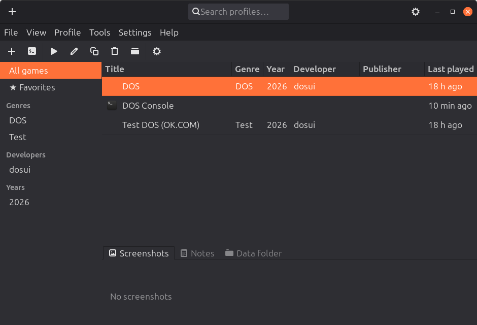

# dosui

A lightweight, native **Linux frontend for [DOSBox](https://www.dosbox.com/)** —
a game/profile launcher and configuration manager in the spirit of
[D-Fend Reloaded](https://dfendreloaded.sourceforge.io/), but without the Java
runtime and without the Windows baggage.

[](https://github.com/lexandro2000/dosui/actions/workflows/ci.yml)
[](LICENSE)
[](https://www.rust-lang.org/)
[](https://www.gtk.org/)



## Why dosui?

Existing launchers (e.g. **DBGL** and **D-Fend Reloaded**) are heavyweight: they
need a Java runtime or are Windows-centric. dosui aims to be a **fast-starting,
low-dependency, natively integrated** alternative for the Linux desktop. You
manage one profile per game, tweak the important `dosbox.conf` settings from a
GUI, and launch — no hand-editing INI files.

## Features

- **Profile library** with cover art, a sortable details list, and an icon view
  (D-Fend-style layout: category tree on the left, list on top, tabbed preview
  below — **Screenshots / Notes / Data folder**).
- **Tabbed profile editor** (General / Mounts & Run / CPU / Graphics / Sound /
  MIDI / Advanced) with a live `dosbox.conf` preview.
- **New-profile wizard** — point at a folder, auto-scan for `.exe`/`.bat`/`.com`,
  fill in metadata.
- **Global defaults** every profile inherits, plus per-profile overrides.
- **Built-in "DOS Console"** profile: a bare DOSBox prompt with a ready C: drive,
  re-addable from the toolbar if you delete it.
- **Category sidebar** (genre / developer / year / favourites) and
  find-as-you-type search.
- Favourites, duplicate, delete, open-folder, and **bulk metadata editing**.
- **Import** existing setups: `dosbox.conf` (D-Fend / DBGL) and zipped games
  (drag & drop supported).
- Ships as a single **AppImage** that bundles `dosbox-staging` yet follows your
  host GTK theme.

## Installation

### AppImage (recommended)

Grab the latest `dosui-x86_64.AppImage` from the
[Releases](https://github.com/lexandro2000/dosui/releases) page, then:

```sh
chmod +x dosui-x86_64.AppImage
./dosui-x86_64.AppImage
```

The AppImage bundles the GTK 4 runtime and `dosbox-staging`, so no system
DOSBox is required. It still follows your desktop's GTK theme.

### From source

You need a stable **Rust toolchain** (MSRV 1.80 — see `rust-version` in
[`Cargo.toml`](Cargo.toml); install via [rustup](https://rustup.rs/)) and the
**GTK 4 development libraries**.

Install the build dependencies for your distro:

| Distro                | Command                                                                  |
| --------------------- | ------------------------------------------------------------------------ |
| Debian / Ubuntu / Mint| `sudo apt install build-essential libgtk-4-dev librsvg2-common`           |
| Fedora                | `sudo dnf install gcc gtk4-devel librsvg2`                                |
| Arch / Manjaro        | `sudo pacman -S --needed base-devel gtk4 librsvg`                         |
| openSUSE              | `sudo zypper install gcc gtk4-devel librsvg-2`                            |

Then build, run, and (optionally) install. A [`Makefile`](Makefile) wraps the
common tasks:

```sh
make            # build the release binary (target/release/dosui)
make run        # run from source
make check      # fmt + clippy + test (the same gate CI runs)
sudo make install            # install into /usr/local (binary, .desktop, icon, metainfo)
sudo make install PREFIX=/usr  # or pick a prefix; honours DESTDIR for packaging
sudo make uninstall          # remove it again
```

Prefer plain Cargo? `cargo run --release` works too. When running from source,
dosui uses a `dosbox-staging` (or `dosbox`) found on your `PATH`; you can also
point it at a specific binary in **Settings**.

## Usage

1. **Add a game** — toolbar ▸ *New profile*, or drag a zipped game onto the
   window, or *Import* an existing `dosbox.conf`.
2. **Tune it** — *Edit* opens the tabbed editor; the `dosbox.conf` preview
   updates live.
3. **Play** — double-click the tile (or *Run*). dosui regenerates the profile's
   `dosbox.conf` and launches DOSBox.

### Where your data lives

dosui follows the XDG base-directory spec:

| Path                         | Contents                                  |
| ---------------------------- | ----------------------------------------- |
| `~/.config/dosui/`           | settings + global defaults (TOML)         |
| `~/.local/share/dosui/`      | the profile library (the valuable content)|

dosui's own files are **TOML**. The generated `dosbox.conf` is an output
artifact — never a source of truth.

## Packaging an AppImage

```sh
make appimage          # or: ./packaging/build-appimage.sh   -> dist/dosui-x86_64.AppImage
```

The script bundles `dosbox-staging` and the GTK runtime. It uses a local
dosbox-staging build if one is under `~/.local/opt/dosbox-staging*` (override
with `DOSBOX_STAGING_DIR`), otherwise it downloads a pinned version
(`DOSBOX_STAGING_VERSION`). The same script runs in the tag-driven
[Release workflow](.github/workflows/release.yml) — see
[docs/RELEASING.md](docs/RELEASING.md). The bundled `dosbox-staging` is
GPL-2.0-or-later and ships as a separate program (mere aggregation); dosui's own
code is MIT.

## Contributing

Contributions are welcome — see [CONTRIBUTING.md](CONTRIBUTING.md) for the dev
workflow, coding principles, and how the codebase is organised. A high-level map
lives in [docs/ARCHITECTURE.md](docs/ARCHITECTURE.md). By participating you agree
to the [Code of Conduct](CODE_OF_CONDUCT.md).

## Scope

- **Not** a DOSBox replacement — dosui drives an existing `dosbox-staging` /
  `dosbox` / `dosbox-x` binary.
- **Linux-first.** Windows/macOS are not targeted for now.

## License

[MIT](LICENSE) © 2026 lexandro2000.

## Acknowledgements

- Inspired by [D-Fend Reloaded](https://dfendreloaded.sourceforge.io/) and
  [DBGL](https://dbgl.org/).
- Powered by [dosbox-staging](https://dosbox-staging.github.io/) and
  [gtk4-rs](https://gtk-rs.org/).
